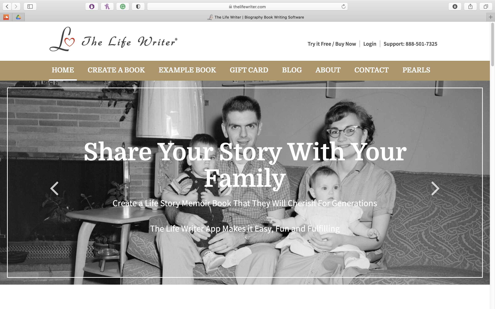

# Assignment 01: Heuristic Evaluation - Joy Hsieh, DH110
## Tentative Title: Senior Stories
Throughout the years, I've heard tidbits of stories from my grandparents and their siblings. My grandma got into college by going on a hunger strike to pressure her parents into letting her attend. My grandpa grew up in Taiwan during the martial law period and performed mandatory military service. My great aunt was a single mother and a flight attendant, at a time when not many women supported themselves and their children independently.

As my grandparents have gotten older, I've felt a great desire to capture as many stories from their lives as I can so that they may be preserved and retold to future generations of our family. I want to contribute with this UX project by creating a website or app that people like my grandparents can go to and record their life stories.

In this assignment, I will conduct a heuristic evaluation of two websites with goals similar to the ones of this project. The first, TimeSlips, allows seniors to write creative stories. The second, The Life Writer, provides a way for seniors to write a memoir book. The evaluation will discuss each site's adherence to the [10 Usability Heuristics for User Interface Design](https://www.nngroup.com/articles/ten-usability-heuristics/) and provide [Severity Ratings for Usability Problems](https://www.nngroup.com/articles/how-to-rate-the-severity-of-usability-problems/) with consideration for the target users, senior citizens.

## Competitor A: TimeSlips

View the full site here: [TimeSlips](http://timeslips.org)
#### Background Information
TimeSlips is an organization with a mission to help seniors to write creative stories. To do this, users can make an account, go to their "Creativity Center", and select a prompt to follow. From there, users can type their story in a text box or upload a photo of a written response. The website also has extensive information on what TimeSlips is, services that they provide, resources, news, and ways to get involved with the organization.
#### Heuristic Evaluation
Overall:

## Competitor B: The Life Writer

View the full site here: [The Life Writer](https://www.thelifewriter.com)
#### Background Information
The Life Writer is a website with a mission to helps seniors author an autobiographical memoir. To do this, users can make an account and answer some basic life questions. Based on these responses, The Life Writer will create "chapters" that the users can use as a guide to write their stories and add related photos. When the user is done, the book can be downloaded or printed. This website also feautures a background on The Life Writer, an example book, blog, and testimonials.
#### Heuristic Evaluation
Overall:

| chick fil a | Debit | Food          |
|-------------|-------|---------------|
| wine (vons) | Debit | Fun           |
| 7 leaves    | Debit | Boba & Drinks |
| CAPM extra  | --    | Other         |
