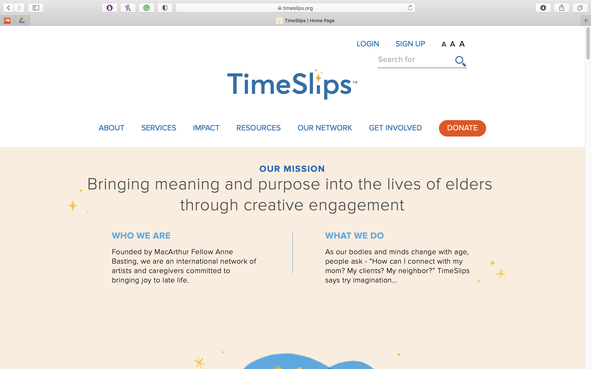

# Assignment 01: Heuristic Evaluation - Joy Hsieh, DH110
## Tentative Title: Senior Stories
Throughout the years, I've heard tidbits of stories from my grandparents. As they get older, I realize how precious the time I have left with them is. **i will add more text here!**

In this assignment, I will conduct a heuristic evaluation of two products with similar goals as mine. The first, TimeSlips, allows seniors to write creative stories. The second, Simply Life Stories, 
### Competitor A: TimeSlips

View the full site here: [TimeSlips](http://timeslips.org)
#### Background Information
TimeSlips is an organization with a mission to "Bring meaning and purpose into the lives of elders through creative engagement". The main goal is to allow seniors to write creative stories. To do this, users can make an account for free, go to their "Creativity Center", and select a prompt to follow. From there, users can type their story in a text box or upload a photo of a written response. The website also has extensive information on what TimeSlips is, services that they provide, resources, news, and ways to get involved with the organization.
#### Heuristic Evaluation

### Competitor B: Simply Life Stories

View the full site here: [Simply Life Stories](https://www.simplylifestories.com/life-story-recording.html)
#### Background Information
SimplyLifeStories is a team dedicated to 
#### Heuristic Evaluation
